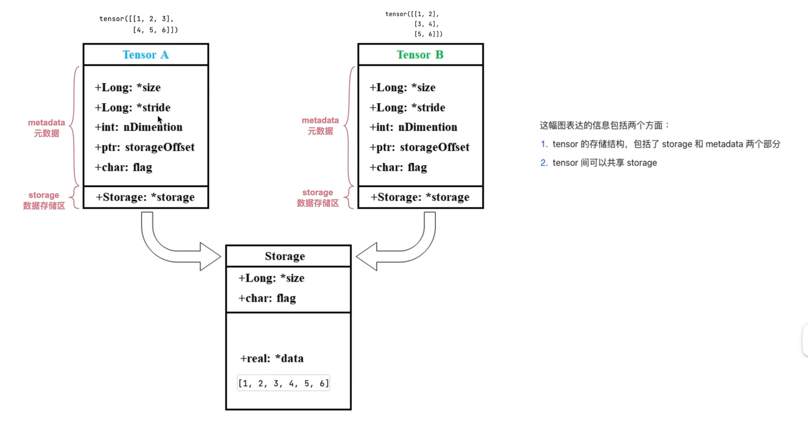
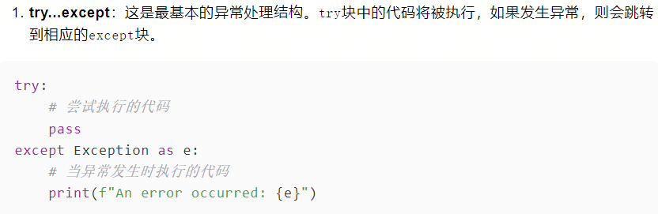
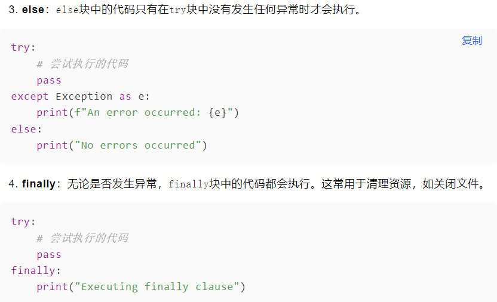
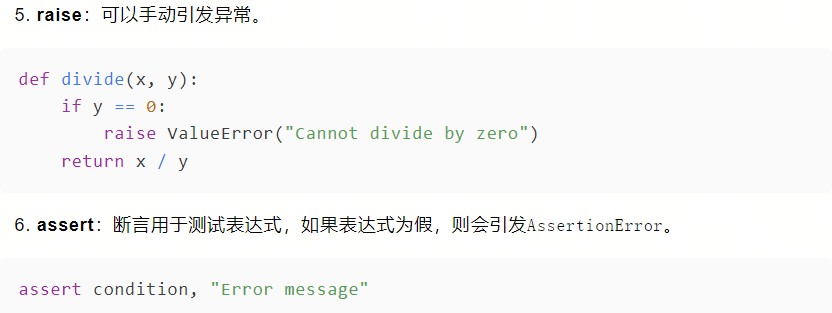
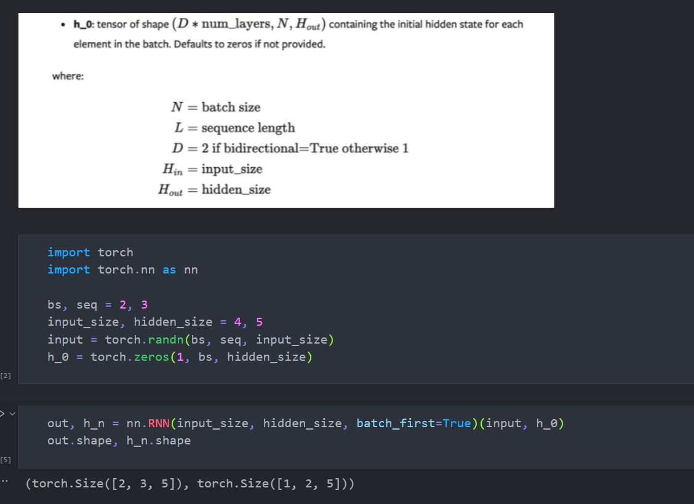

## 1.tensor的内部存储



storage以一维数组存储数值本身，metadata存储tensor相关信息

## 2.日志

### 2.1logging

```python
import logging

logging.debug("This is a debug message")
logging.info("This is an info message")
logging.warning("This is a warning message")
logging.error("This is an error message")
logging.critical("This is a critical message")
```

output：默认只输出`warning`以上级别的信息

```python
WARNING:root:This is a warning message
ERROR:root:This is an error message
CRITICAL:root:This is a critical message
```

**修改打印级别等配置**

```python
import logging

logging.basicConfig(level=logging.DEBUG,  # 日志级别
                    # filename='test.log',  # 写入本地文件
                    # filemode='a',  # 追加模式,"w"为覆盖写入
                    format='%(asctime)s - [line:%(lineno)d] - %(levelname)s: %(message)s' # 日志格式
                    )
```

### 2.2tensorboard

启动命令：

```
tensorboard --logdir my_log
```

使用：

```python
from torch.utils.tensorboard import SummaryWriter

writer = SummaryWriter(log_dir='runs/mock_accuracy')
for i in range(100):
    writer.add_scalar(tag="accuracy", #可以暂时理解为图像的名字
                      scalar_value=i * random.uniform(0.8, 1),  # 纵坐标的值
                      global_step=i  # 当前是第几次迭代，可以理解为横坐标的值
                      )
```

```python
# 训练模型
total_steps = 0
for epoch in range(num_epochs):
    for i, (inputs, targets) in enumerate(dataloader):
        model.train()
        outputs = model(inputs)
        loss = criterion(outputs, targets)

        optimizer.zero_grad()
        loss.backward()
        optimizer.step()

        total_steps += 1
        # 每个step记录损失到TensorBoard
        writer.add_scalar('Loss/train', loss, total_steps)

        if total_steps % 10 == 0:
            print(f'Epoch [{epoch+1}/{num_epochs}], Step [{total_steps}], Loss: {loss.item():.4f}')

# 关闭SummaryWriter
writer.close()
```

## 3.可视化

### 3.1torchsummary

```python
from torchsummary import summary

summary(model,(),bs)
```

### 3.2netron

netron.app

### 3.3wandb

api-key、登录

```python
89220449c735e0cf8207f23230cf7b70ec98c04d

pip install wandb

import os
os.environ["wandb_api_key"]="89220449c735e0cf8207f23230cf7b70ec98c04d"

import wandb
wandb.login()
```

管理超参

```python
# train.py
import wandb
import random

epochs = 10
lr = 0.01

run = wandb.init(
    # Set the project where this run will be logged
    project="my-awesome-project",
    # Track hyperparameters and run metadata
    config={
        "learning_rate": lr,
        "epochs": epochs,
    },
)

offset = random.random() / 5
print(f"lr: {lr}")

for epoch in range(2, epochs):
    acc = 1 - 2**-epoch - random.random() / epoch - offset
    loss = 2**-epoch + random.random() / epoch + offset
    print(f"epoch={epoch}, accuracy={acc}, loss={loss}")
    wandb.log({"accuracy": acc, "loss": loss})
```

## 4.查看模型结构

```python
for children in model.children(): # named_children()
    print(children)
    print('-----------------')
```

## 5.早停

```python
import logging


class EarlyStop:
    def __init__(self, patience=30):
        self.best_fiteness = 0.0  # 指标
        self.best_epoch = 0
        self.patience = patience or float("inf")  # 早停的阈值

    def __call__(self, epoch, fitness):
        if fitness > self.best_fiteness:
            self.best_fiteness = fitness
            self.best_epoch = epoch

        delta = epoch - self.best_epoch
        stop = delta >= self.patience
        if stop:
            logging.info(f"Early stopping at epoch {epoch}")

        return stop


stopper = EarlyStop()
stop = False

for epoch in range(epochs):
    # train
    # val

    stop = stopper(epoch, fitness)
    if stop:
        break
```

## 6.matplotlib可视化

在使用imshow()展示图片前，需要先将图片读取出来。

读取图片可以通过pillow库，也可以用matplotlib本身自带的image模块实现。

```python
import os
import matplotlib.image as mpimg
from PIL import Image
import matplotlib.pyplot as plt
import numpy as np
import matplotlib as mpl
mpl.rcParams['font.sans-serif'] = ['SimHei']  # 中文字体支持

# 使用pillow库读取图片，关闭坐标轴
img = Image.open(r"./jupyter/matplotlib/images/1.jpg")
fig = plt.figure(figsize=(8, 4))
ax1 = fig.add_subplot(111)
ax1.imshow(img)
ax1.axis('off')

plt.show()
```

## 7.TSNE可视化高维特征

```python
import numpy as np
import matplotlib.pyplot as plt
from sklearn.manifold import TSNE

vecArr = np.random.rand(1000,512) #构造1000个512维向量, 换成实际需要聚类的向量即可
tsneData = TSNE().fit_transform(vecArr)

#开始进行可视化
f = plt.figure(figsize=(10,10))
ax = plt.subplot(aspect='equal')
sc = ax.scatter(tsneData[:,0], tsneData[:,1])
plt.xlim(-50,50)
plt.ylim(-50,50)
ax.axis('off')
ax.axis('tight')
plt.show()
```

## 8.异常处理







## 9.RNN


