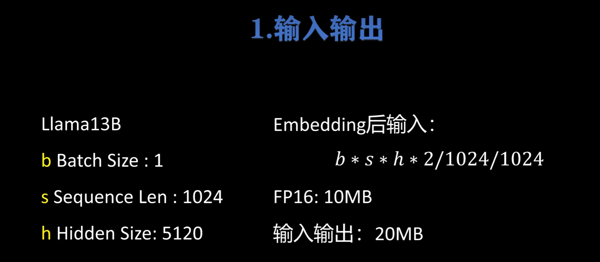
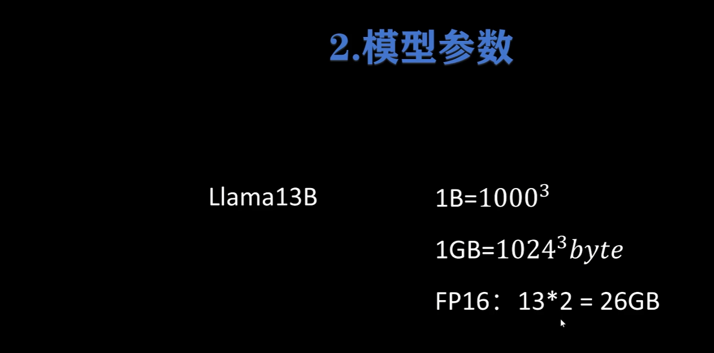
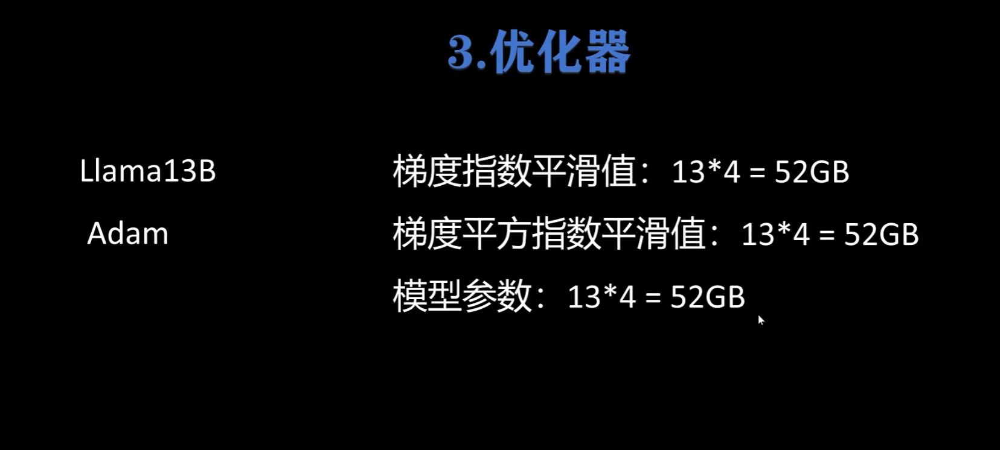
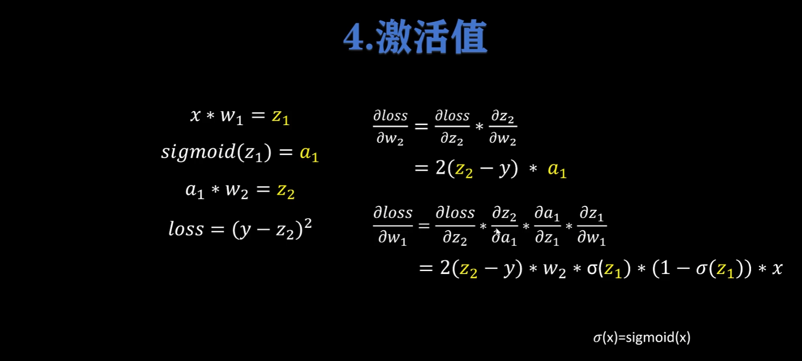
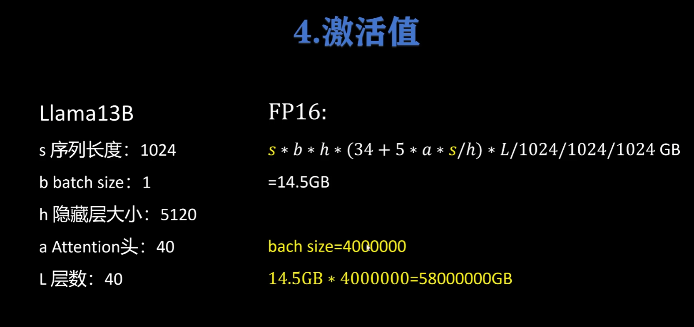
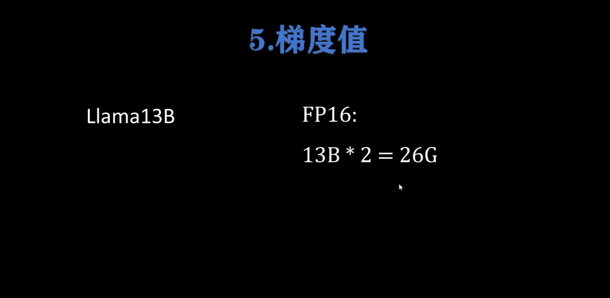
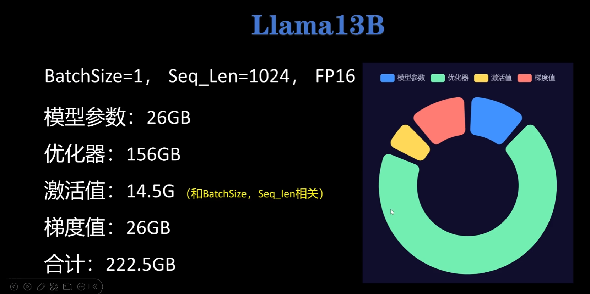

## 1.前置：模型显存分析

```python
1 byte= 8 bit
1 KB = 1024 byte
```

FP32：32 bit，4 byte **//** FP16：16bit，2 byte





**平滑值、参数值(用于更新)以float32存储**



**反向传播需要用到前传的一些值**









## 2.deepspeed核心思想

DeepSpeed的核心就在于，**GPU显存不够，CPU内存来凑**。

DeepSpeed将当前时刻，训练模型用不到的参数，缓存到CPU中，等到要用到了，再从CPU挪到GPU。这里的“参数”，不仅指的是模型参数，还指optimizer、梯度等。

越多的参数挪到CPU上，GPU的负担就越小；但随之的代价就是，更为频繁的CPU，GPU交互，极大增加了训练推理的时间开销。因此，DeepSpeed使用的一个核心要义是，**时间开销和显存占用的权衡**。

## 3.使用

```bash
deepspeed --master_port 29500 --num_gpus=2 run_s2s.py \
--deepspeed ds_config.json

--master_port：端口号。默认为29500，可能会被占用（i.e., 跑了多个DeepSpeed进程）。
--num_gpus: GPU数目，默认会使用当前所见的所有GPU。
--deepspeed: 提供的config文件，用来指定许多DeepSpeed的重要参数。
```

## 4.zero config

传统的深度学习，模型训练并行，是将模型参数复制多份到多张GPU上，只将数据拆分（如，torch的Dataparallel），这样就会有大量的显存冗余浪费。

而ZeRO就是为了消除这种冗余，提高对memory的利用率。注意，这里的“memory”不仅指多张GPU memory，还包括CPU。

而ZeRO的实现方法，就是把参数占用，逻辑上分成三种类型。将这些类型的参数划分：

- optimizer states：即优化器的参数状态。例如，Adam的动量参数。

- gradients：梯度缓存，对应于optimizer。
- parameters：模型参数。

对应的，DeepSpeed的ZeRO config文件就可以分为如下几类：

- ZeRO Stage 1: 优化器状态（如动量、二阶矩等）被分片到不同的设备上，这样每个设备只需要存储和更新其分片部分。这种方法减少了内存需求，但梯度和模型参数仍然需要在每个设备上完整存储。
- ZeRO Stage 2: 除了优化器状态，梯度也被分片到不同的设备上。每个设备只需要存储和计算其负责的梯度部分。
- ZeRO Stage 3: 划分模型参数，或者说，不同的layer. ZeRO-3会在forward和backward的时候，自动将模型参数分配到多个memory。

zero2

```json
{
    "bfloat16": {
        "enabled": "auto"
    },
    "fp16": {
        "enabled": "auto",
        "loss_scale": 0,
        "loss_scale_window": 1000,
        "initial_scale_power": 16,
        "hysteresis": 2,
        "min_loss_scale": 1
    },
    "optimizer": {
        "type": "AdamW",
        "params": {
            "lr": "auto",
            "betas": "auto",
            "eps": "auto",
            "weight_decay": "auto"
        }
    },
    "scheduler": {
        "type": "WarmupLR",
        "params": {
            "warmup_min_lr": "auto",
            "warmup_max_lr": "auto",
            "warmup_num_steps": "auto"
        }
    },
    "zero_optimization": {
        "stage": 2,
        "offload_optimizer": {
            "device": "cpu",
            "pin_memory": true
        },
        "allgather_partitions": true,
        "allgather_bucket_size": 2e8,
        "overlap_comm": true,
        "reduce_scatter": true,
        "reduce_bucket_size": 2e8,
        "contiguous_gradients": true
    },
    "gradient_accumulation_steps": "auto",
    "gradient_clipping": "auto",
    "train_batch_size": "auto",
    "train_micro_batch_size_per_gpu": "auto",
    "steps_per_print": 1e5
}
```

